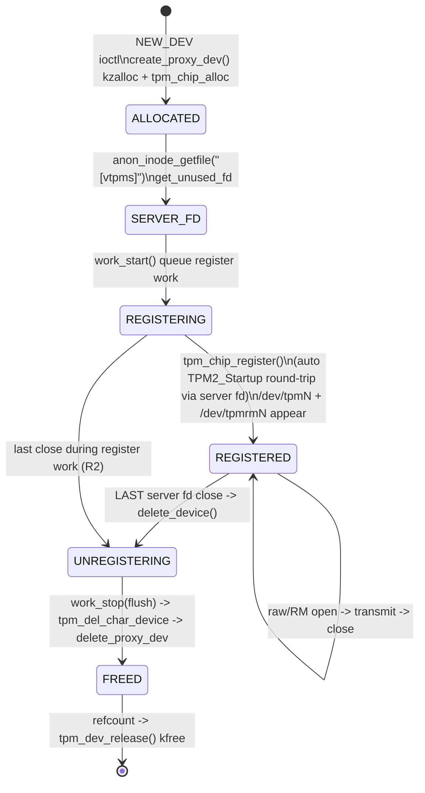

# vtpmx Object-Lifetime Model, Invariants & Deterministic Interleaving Matrix

Target: Linux 6.8 `drivers/char/tpm/tpm_vtpm_proxy.c` (vtpmx, `/dev/vtpmx` major 10 minor 263)
together with the TPM core it rides on: `tpm-chip.c`, `tpm-interface.c`,
`tpm-dev-common.c`, `tpm-dev.c` (raw), `tpmrm-dev.c` (resource manager).

This is the reference model behind the Phase-3 lifetime harnesses (`vtpmx_race`,
`vtpmx_err`, `vtpmx_async`, `vtpmx_lifetime`, `vtpmx_stress`). It is built from source,
then every barrier is exercised deterministically and (on the Generic-KASAN guest) checked
for use-after-free / slab-out-of-bounds. Line numbers refer to Linux 6.8.

> Scope discipline. A clean run means **no memory-safety violation was observed** in the
> defined interleaving space; it is not a proof the driver is bug-free. Each invariant below
> names the exact test that supports it, and the final section lists what is *not* covered.

---

## 1. The two-fd, one-object model

`VTPM_PROXY_IOC_NEW_DEV` on `/dev/vtpmx` (requires `CAP_SYS_ADMIN`, `flags` must be exactly
`VTPM_PROXY_FLAG_TPM2=1`) creates **one `struct proxy_dev`** that is reached through two
independent fd families:

```
 userspace TPM emulator process                     client processes
 ┌───────────────────────────────┐                 ┌────────────────────────┐
 │ open("/dev/vtpmx")            │                 │                        │
 │ ioctl(NEW_DEV)                │                 │   /dev/tpmN   (raw)    │  single open
 │   ── creates proxy_dev ──┐    │                 │   /dev/tpmrmN  (RM)    │  multi open
 │   ── anon_inode "[vtpms]"├─── proxy_dev ─── tpm_chip (tpm_ops = vtpmx)  │
 │   returns server fd  ◄───┘    │                 │        ▲               │
 │ read()  = kernel TPM command  │  server fops    │        │ ops_sem       │
 │ write() = TPM response        │ ◄──────────────►│  every client callback │
 └───────────────────────────────┘                 │  down_read(ops_sem)    │
                                                    └────────────────────────┘
```

* The **server fd** is an anonymous inode `[vtpms]` (`vtpm_proxy_fops`, tpm_vtpm_proxy.c:244).
  Its `release` (`fops_release`:233 → `delete_device`:591) is the *only* destruction trigger.
  `dup()`/fork-shared fds extend its lifetime; destruction happens on the **last** close (L1).
* The **tpm_chip** is registered from a workqueue and exposes a raw frontend (single-open,
  `is_open` test-and-set, `tpm-dev.c`) and an RM frontend (multi-open, one `file_priv` +
  one `tpmrm_priv/space` per open, `tpmrm-dev.c`).
* Both frontends call back into the same `chip->ops`; each callback is bracketed by
  `tpm_try_get_ops()` (`down_read(&ops_sem)`, tpm-chip.c:157) / `tpm_put_ops()`
  (`up_read` + `put_device`, :189 — comment: *"After this returns chip may be kfree'd"*).

---

## 2. Object / state lifecycle

### 2.1 proxy_dev + tpm_chip



`UNREGISTERING` barriers in `tpm_del_char_device()` (tpm-chip.c:444–471), in order:
1. `cdev_device_del()` — stops **new** opens succeeding (:446);
2. `idr_replace(... NULL ...)` — removes the chip from the core idr (:450);
3. `down_write(&chip->ops_sem)` — **waits for every in-flight callback** that holds the
   read lock via `tpm_try_get_ops` (:454);
4. only then `chip->ops = NULL` (:468), `up_write` (:470);
5. the final `put_device` runs `tpm_dev_release()` (:267) which frees context/session banks
   and the chip.

### 2.2 server fd reference count

```
created (anon_inode) --> held by emulator fd A
                     --> dup(A)=B / fork inheritance adds refs
   close a non-last ref --> object stays REGISTERED (L1)
   close the LAST ref    --> fops_release -> delete_device (UNREGISTERING)
```

### 2.3 per-open client work (`struct file_priv`, tpm-dev.h; buffer `data_buffer[4096]` last field)

```mermaid
stateDiagram-v2
    [*] --> OPEN: tpm_open / tpmrm_open (kzalloc file_priv; RM also tpm2_init_space)
    OPEN --> ENQUEUED: NONBLOCK write -> command_enqueued=1, queue_work(tpm_dev_wq)
    ENQUEUED --> RUNNING: tpm_dev_async_work takes buffer_mutex + ops read lock
    RUNNING --> WAIT_RESPONSE: tpm_try_transmit -> tpm_op_send, poll status
    WAIT_RESPONSE --> DONE: emulator write() response -> tpm_op_recv, wake_up(async_wait)
    WAIT_RESPONSE --> CANCELLED: server fd close -> ops teardown -> cancel/-ETIME, wake
    ENQUEUED --> CANCELLED: teardown while still pending (L3-Q sampled window)
    DONE --> OPEN: client read drains response, response_length=0
    OPEN --> CLOSED: release(): flush_work(async)+del_timer_sync+flush_work(timeout), private_data=NULL
    CANCELLED --> CLOSED
    CLOSED --> [*]: RM additionally tpm2_del_space + kfree
```



A second NONBLOCK write while `command_enqueued`/a response is pending returns `EBUSY`
(tpm-dev-common.c `tpm_common_write`); there is at most one async work per `file_priv`.

---

## 3. Object inventory (creator / owner / barrier / lock / worker)

| Object | Created by | Used by | Lifetime / destruction barrier | Async worker · Lock |
|---|---|---|---|---|
| `proxy_dev` (fixed `buffer[4096]`, `state`, `wq`, `work`) | `create_proxy_dev` kzalloc:493 + `tpm_chip_alloc`:501 | server fops + chip callbacks | last server-fd close → `delete_device`:591 → `delete_proxy_dev`:521 | register `work`:451 on `"tpm-vtpm"` wq · `buf_lock`:35 |
| server fd `[vtpms]` | `anon_inode_getfile`:556 | emulator process | file refcount; `fops_release`:233 only on **last** close | — |
| `tpm_chip` | `tpm_chip_alloc`:501; registered by register work | raw + RM frontends, core | `tpm_del_char_device`: cdev del → idr NULL → `down_write(ops_sem)` → ops=NULL → kref `tpm_dev_release`:267 | auto-startup in register work · `ops_sem`, `ops` |
| raw fd `/dev/tpmN` | `tpm_open` tpm-dev.c:18 | one client at a time | `is_open` test-and-set (2nd open `EBUSY`); `tpm_release`:49 | per-fd async work · `buffer_mutex` |
| RM fd `/dev/tpmrmN` | `tpmrm_open`:13 (`tpm2_init_space`) | many concurrent clients | independent `file_priv`/space each; `tpmrm_release`:35 (`tpm2_del_space`) | per-fd async work |
| `file_priv` (+`data_buffer[4096]`) | open path | one open fd | `tpm_common_release`:262 `flush_work(async)`+`del_timer_sync`+`flush_work(timeout)` | `async_work`, `user_read_timer(120s)`, `timeout_work` · `buffer_mutex` |
| `tpm_ops` (vtpmx, `flags=AUTO_STARTUP`) | `tpm_ops`:434 at register | every client path | read-side `tpm_try_get_ops`/`put_ops` vs write-side teardown under `ops_sem` | — |
| request buffer (embedded 4096) | `create_proxy_dev` | `fops_read`/`fops_write`/`tpm_op_recv`/`tpm_op_send` | 4 copy points check `TPM_BUFSIZE` under `buf_lock`; no dynamic size arithmetic | `buf_lock` |
| register work | `work_start`:570 | chip registration + auto-startup | `work_stop`:470 = `fops_undo_open` + `flush_work` (R2) | `"tpm-vtpm"` wq |

---

## 4. Lifetime Invariant Table

| ID | Invariant | Mechanism in source | Test(s) |
|---|---|---|---|
| **I1** | The chip/proxy_dev lives exactly as long as an open server-file description; `dup` extends it, and only the **last** server close tears it down. | anon_inode file refcount → `fops_release`:233 → `delete_device`:591 | **L1**, R5 |
| **I2** | No client callback may dereference `chip->ops` after teardown begins. New opens are refused first, the idr is nulled, and the write-side `ops_sem` waits for all read-side callbacks before `ops=NULL`. | `tpm_del_char_device`:446/450/454/468 vs `tpm_try_get_ops`:157 | **L2, L3-R, L4**, R1, R7 |
| **I3** | An async work parked in `WAIT_RESPONSE` is cancelled and its client woken on server close; `release()` `flush_work` cannot hang forever. | teardown → transmit fails/cancels (-ETIME/EPIPE); `tpm_common_release`:262 | **L3-Q, L3-R**, R4c, R10 |
| **I4** | The raw frontend is single-open; a concurrent open gets `EBUSY`, and close releases the slot. | `test_and_set_bit(is_open)` tpm-dev.c:18 | probe, R7 errno histogram |
| **I5** | Each RM open owns an independent `file_priv`/space; closing one RM fd must not disturb other RM fds or the shared chip; the chip survives until the server fd closes. | per-open `kzalloc`+`tpm2_init_space`:13, `tpm2_del_space`:35; chip refcount independent of RM fds | **L5** |
| **I6** | A client operation issued after/across chip teardown returns a **bounded** error (EPIPE/EIO/ETIME/ECANCELED) within the timeout, never an unbounded block or a freed-object access. | `tpm_try_get_ops` failure → EPIPE; `req_canceled` → ECANCELED; ordinal timeout → -ETIME | **L2**, R1, R3 |
| **I7** | `f_pos` is never user-settable on raw/RM fds (`no_llseek` → ESPIPE), so the `data_buffer + *off` read/clear path in `tpm_common_read` cannot be driven out of bounds. | tpm_fops:62 / tpmrm_fops `.llseek=no_llseek`; write resets `*off=0`; read keeps `*off+len==total≤4096` | probe (lseek ESPIPE), static audit **SAFE-CURRENT** |
| **I8** | All user/kernel copies are bounded by the fixed `TPM_BUFSIZE=4096` under `buf_lock`; there is no user-controlled allocation-size arithmetic, so integer-overflow→undersized-alloc does not apply. | `tpm_op_send`:334 etc.; `struct proxy_dev.buffer[4096]`:45 | probe, err E1/E4 |
| **I9** | Tearing down a NEW_DEV while its register work (incl. auto-startup) is in flight waits for that work; no use-after-unregister. | `work_stop`:470 (`fops_undo_open`+`flush_work`) | **R2** (4 timings, 22–549 ms) |
| **I10** | Failed NEW_DEV rollback paths (unused-fd allocation, anon-inode, copy_to_user) leave no fd or device behind. | `err_put_unused_fd`:579 / `err_delete_proxy_dev`:582; vtpmx_ioc:645-650 | **E1–E4** |
| **I11** | Under continuous create/churn and even abnormal process death, fd count and `/dev/tpmN` nodes return to baseline (per-fd teardown is reliable). | cdev/refcount + per-fd release | **R7**, SIGKILL mid-run, R9 (40-device loop) |
| **I12** | The single NEW_DEV ioctl is fixed-size (20-byte struct, `_IOWR`), requires `CAP_SYS_ADMIN`, rejects unknown flag bits, and defaults unknown ioctls to `ENOIOCTLCMD`; compat goes through `compat_ptr_ioctl`. | vtpmx_ioc_new_dev:624-660, vtpmx_fops:673 | probe, err E1/E2 |

---

## 5. Deterministic interleaving matrix

"Gate" = the userspace synchronization primitive (pipes + a gated emulator) that pins the
kernel to an exact state before the teardown event. L3-R and the R-cases are *deterministic*;
L3-Q is a high-frequency sample of a window whose exact scheduling instant is not
userspace-pinnable (stated honestly, not claimed as deterministic).

| Case | State A (held) | State B (event) | Expected barrier / result | Gate | Harness |
|---|---|---|---|---|---|
| R1 | blocking transmit in WAIT_RESPONSE | server fd close mid-command | in-flight client gets bounded ETIME; `close` returns ~0 ms (teardown does not block on it) | gated emulator | vtpmx_race R1 |
| R2 | register work / auto-startup in flight | NEW_DEV teardown at 4 timings | `flush_work` completes 22–549 ms, no hang/UAF | drain-aware | vtpmx_race R2 |
| R3 | response in flight | client disappears | bounded EPIPE/EIO, no crash | fork client | vtpmx_race R3 |
| R4 | NONBLOCK async happy path | 2nd enqueue before drain | 2nd write `EBUSY`; poll wakes EPOLLIN; read=10; re-arm works | — | vtpmx_async R4 |
| R4c | async work in WAIT_RESPONSE | server close | cancel + poll/read wake in ~825 ms, no hang | gated | vtpmx_async R4c |
| R5 | fd dup / permission permutation | write to closed/wrong fd | closed fd EBADF; live dup still serves | dup | vtpmx_race R5 / **L1** |
| R9 | 40-device create/destroy loop | — | tpm number recycle, no fd leak | — | vtpmx_race R9 |
| R10 | async in flight, client `close` | mode0 respond-first / mode1 cancel-first | `release` flush 106 ms / 864 ms, both clean | gated | vtpmx_async R10 |
| **L1** | server fd A and dup B both open | close A, serve via B, then close B | device alive & serviceable after A; gone after last close | dup + emulator re-targets poll fd | vtpmx_lifetime L1 |
| **L2** | RM client fd open | chip torn down (server close) while held | orphan write/poll/read bounded, `lseek` ESPIPE, close < 15 s, KASAN clean | — | vtpmx_lifetime L2 |
| **L3-Q** | NONBLOCK work just enqueued (pending/early-running) | immediate server close, ×15 | flush/cancel bounded, client woken, node gone, no hang | no delay (sampled window) | vtpmx_lifetime L3-Q |
| **L3-R** | work deterministically RUNNING in WAIT_RESPONSE | server close, ×3 | cancel/wake deterministic, client close clean, node gone | gated: REQ anchor → gate → READ anchor proves running | vtpmx_lifetime L3-R |
| **L4** | raw work gated RUNNING + RM work queued (separate file_priv) | last/only server close | both works torn down together; both client fds close clean | gated drain=2 | vtpmx_lifetime L4 |
| **L5** | RM-A/RM-B open & transmit; close A; open C; close B; transmit C; close C; raw still opens | staggered RM closes | per-open spaces isolated; B/C unaffected by A's close; shared chip healthy until server close | FREE emulator | vtpmx_lifetime L5 |
| **R7** | 6-slot live pool, recycler tears down/recreates a random slot every 30–280 ms | 2 raw + 2 RM clients race opens/transmits/closes vs churn (R1/R3/R4c/R10 mix) | no hang; fds & nodes return to baseline; lseek always ESPIPE; KASAN is authority | device pool + fixed seed + ms event log | vtpmx_stress (seeds 0x1234/0x1337/0x1338) |
| E1 | NULL/unmapped ioctl arg | NEW_DEV | EFAULT before alloc | — | vtpmx_err E1 |
| E2 | reserved flag bits set | NEW_DEV | EOPNOTSUPP, no fd growth | — | vtpmx_err E2 |
| E3 | fd table exhausted | NEW_DEV ×80 | stable EMFILE; after rlimit restore, fd count back to baseline | setrlimit | vtpmx_err E3 |
| E4 | arg page flipped read-only between copy_in/copy_out | NEW_DEV | EFAULT, zero fd leak, bounded rollback | mprotect | vtpmx_err E4 |

---

## 6. Exit-code / result convention (machine readable)

Harnesses print a final `RESULT:` line and use one process exit code so the boot matrix can
separate **kernel health** from **harness health** (`tools/kasan_triage.sh`):

| Exit | Meaning |
|---:|---|
| 0 | `RESULT: PASS` — assertions held in this run |
| 1 | `RESULT: ASSERT_FAIL` — a defined invariant was violated (investigate; on KASAN guest correlate with dmesg) |
| 2 | `RESULT: ENV_ABORT` — environment/scheduling (e.g. TCG CPU starvation prevented auto-startup; device pool could not fill). **Not a vulnerability.** |
| 3 | `RESULT: HARNESS_ERROR` / `[HANG]` — harness internal fault or watchdog (possible kernel deadlock; always inspect dmesg) |

`kasan_triage.sh` reports them independently:
`KERNEL_RESULT` (KASAN/BUG/Oops/UAF/OOB/refcount/panic from serial log) vs
`HARNESS_RESULT` (completed / env_abort / assertion_fail / hang).

---

## 7. Evidence strength and honest boundaries

* **Deterministically proven (gated):** R1, R2, R4c, R10, L1, L3-R, L4 — the kernel state is
  confirmed by an emulator anchor *before* the teardown event.
* **Deterministic logic, repeated coverage:** L3-Q samples the pending/early-running window;
  userspace cannot guarantee the worker has not started, so we do not claim a pure-pending
  barrier, only that the immediate enqueue→teardown path is repeatedly safe.
* **Statistical interleaving:** R7 explores the combined space with fixed seeds; it raises
  confidence but is not a proof.
* **Not covered here (do not over-claim):**
  - malicious/emulator-controlled *response contents* deep parser paths beyond length/header
    checks (the harness emulator returns a fixed 10-byte success; TPM grammar R0–R5 is future
    work — semantically incomplete responses are accepted for *lifetime* tests only);
  - TPM 1.2 (`flags=0`) and `SET_LOCALITY` paths beyond confirming the EFAULT rejection;
  - races inside the TPM crypto/command code reached only by well-formed authenticated
    commands;
  - KCSAN-class data races (only justified if a concrete lockless writer/reader hypothesis
    exists; Generic-KASAN clean does not motivate running KCSAN on TCG).
* A KASAN-clean guest supports only the statement: *"Across the 42 deterministic checks plus
  L1–L5 and the R7 interleaving space, no memory-safety violation was observed."*

---

## 8. Method transfer (next target: FUSE request lifetime)

The same scaffold moves to a new subsystem by re-defining the objects, not the process:

`userspace ABI → request/object → queue → userspace completion → shared state → abort/teardown ordering`

For FUSE (`fs/fuse/dev.c`) the mapped objects are `fuse_conn / fuse_dev / fuse_req / folio`,
the teardown events are **abort / umount / daemon death**, and the priority windows are
**request pending × abort** and **interrupt × original completion** (both orders
`interrupt→original` and `original→interrupt` are legal; and a request copying userspace data
must not be freed by abort mid-copy). L3-Q/L3-R style gating and the same triage/exit-code
convention apply unchanged.
